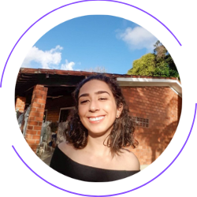

# Accenture - Gama Academy - Mulheres em Tech - Data Engineer/Azure - SQL

Este é o repositório da versão do projeto em SQL.

Para retornar ao repositório geral, clique [aqui](https://github.com/SheAnalyzes/readme-repository)!

## Índice

  - [Apresentação do problema](#apresentação-do-problema)
  - [Objetivos](#objetivos)
  - [Analisando o problema](#analisando-o-problema)
  - [🛠 Tecnologias utilizadas](#-tecnologias-utilizadas)
  - [Features](#features)
  - [Relatório SQL](#relatório-sql)
  - [Grupo](#grupo)
  
**=================**

## Apresentação do problema

Desenvolver uma aplicação em Python para carga de arquivos em um banco de dados SQL e gerar relatórios estatísticos visando a descoberta de fraudes em conta correntede cartão de crédito.

Você pode encontrar o link do desafio [aqui](https://docs.google.com/document/d/10fBZm7Sxm60FEIyNk4rqUE-pJLhXRxDi1grAATF7hVw/edit)!

**=================**

## Objetivos

Seu objetivo inicial é analisar arquivos criando uma base de dados relacional para fazer a carga e depois analisá-la. A conta corrente fraudada, será aquela que tiver movimentações abaixo de 2 minutos de espaçamento entre as transações.

**=================**

## Analisando o problema

A análise inicial do problema foi feita a partir da análise dos dados recebidos. A partir daí, foram pensadas em algumas etapas:

* O Brainstorm inicial das etapas pode ser visualizado [aqui](https://whimsical.com/projeto-final-5zim4iYZrkWQ2Dbpy2knML](https://whimsical.com/projeto-final-5zim4iYZrkWQ2Dbpy2knML)

* O kanban do projeto com a divisão das atividades pode ser visualizado [aqui](https://trello.com/b/4JhJb0Iz/project-data-azure-desafio-final)

**=================**

## 🛠 Tecnologias utilizadas

As seguintes ferramentas foram usadas nessa ETAPA do projeto:

<ul>    <li>Git</li>
  <li>Linguagem SQL</li>
    <li>Trello</li>
    <li>Banco de Dados - Azure Data Studio</li>
</ul>
  
**=================**

## Features

- [x]  Script de migração em Pandas - Para acessar o repositório do projeto em Pandas, acesse [aqui](https://github.com/SheAnalyzes/projeto-final-pandas/).
- [x]  Script de migração em Spark - Para acessar o repositório do projeto em Spark, acesse [aqui](https://github.com/SheAnalyzes/projeto-final-spark).
- [x]  Relatórios de análise em SQL
- [x]  Relatórios de análise em PowerBI - Para acessar o repositório do relatório em PowerBI acesse [aqui](https://github.com/SheAnalyzes/projeto-final-powerbi).
- [x]  Códigos versionados no github.com

**=================**

## Relatório SQL

<li>- [x]  Relação de todos os registros da tabela transacoes<li>

  

<li>- [x]  Proporção de fraudes nas transações de entrada<li>

  

<li>- [x]  Proporção de fraudes nas transações de saída<li>

  

<li>- [x]  Proporção de fraudes nas transações totais<li>

  

<li>- [x]  Função para formatação de moeda<li>

  

<li>- [x]  Procedure para realizar a busca de um id de cliente na tabela de transações<li>

  

<li>- [x]  Verificação de clientes que realizaram transações, mas não tem cadastro<li>

  

<li>- [x]  Verificação de clientes que realizaram transações com suspeita de fraude, mas não tem cadastro<li>

  

<li>- [x]  Verificação de clientes que não realizaram transações<li>

  

<li>- [x]  Demonstração dos clientes fraudados na entrada, informando o total do valor fraudado e a quantidade de fraudes por clientes<li>
  
  
  
<li>- [x]  Demonstração dos clientes fraudados na saida, informando o total do valor fraudado e a quantidade de fraudes por clientes<li>
  
  
  
<li>- [x]  Agrupado por ano, demonstra qual mês houve maior insidencia de fraudes de entrada<li>
  
 
  
<li>- [x]  Agrupado por ano, demonstra qual mês houve maior insidencia de fraudes de saida<li>
  
 
  
<li>- [x]  Query dos clientes cadastrados, qual ddd que aparece com maior insidencia nas fraudes de transacoes de entrada<li>
  
 
  
<li>- [x]  Query dos clientes cadastrados, qual ddd que aparece com maior insidencia nas fraudes de transacoes de saida<li>
  
 
  
<li>- [x]  Procedure demonstrativa dos meses com maior fraude de cada ano diferenciando por origem da fraude<li>
  
 
  
<li>- [x]  Consultando a tabela criada pela procedure que mostra os meses com maior numero de fraudes de cada ano diferenciando por origem da fraudes<li>
  
 
  
<li>- [x]  VIEW criação de view para porcentagem de fraudes<li>
  
 
  
<li>- [x]  Consultando a view da porcentagem de fraudes<li>
  
 

  
  **=================**
   
## Grupo

| Ana Paula Santos de Queiroz  Linkedin: [/ana-paula-santos-de-queiroz-086807166](https://www.linkedin.com/in/ana-paula-santos-de-queiroz-086807166/) Github: [/Queirozaps](https://github.com/Queirozaps) |  |
| :---------------------------------------------------------------------------------------------------------------------------------------------------------------------------------------------------------------: | :--------------------------------------------: |
|  **Arianna Silveira Santos**    Linkedin: [/arianna-silveira-aa474514b](https://www.linkedin.com/in/arianna-silveira-aa474514b/) Github: [/AriannaSilveira](https://github.com/AriannaSilveira)  |  |
|                            **Carolina Gois**  Linkedin: [/carolina-gois](https://www.linkedin.com/in/carolina-gois/) Github: [/carolgois](https://github.com/carolgois)                            |  |
|                   **Emilly Correa Santiago**  Linkedin: [/emillysantiago23](https://www.linkedin.com/in/emillysantiago23/) Github: [/emillysant](https://github.com/emillysant)                   |  |
|                              **Mariana Freire**  Linkedin: [/maricf](https://www.linkedin.com/in/maricf/) Github: [/marianafreire](https://github.com/marianafreire)                              |  |
|             **Priscila Assumpção Fernandes**  Linkedin: [/priscila-af](https://www.linkedin.com/in/priscila-af/) Github: [/priscilaassumpcao](https://github.com/priscilaassumpcao)             |  |
|                    **Vivian Medina**  Linkedin: [/vivian-medina-b7250961](https://www.linkedin.com/in/vivian-medina-b7250961/) Github: [/medinavi](https://github.com/medinavi)                    |  |
 

