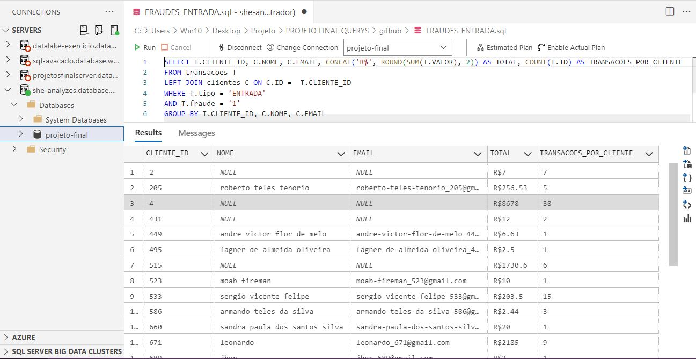
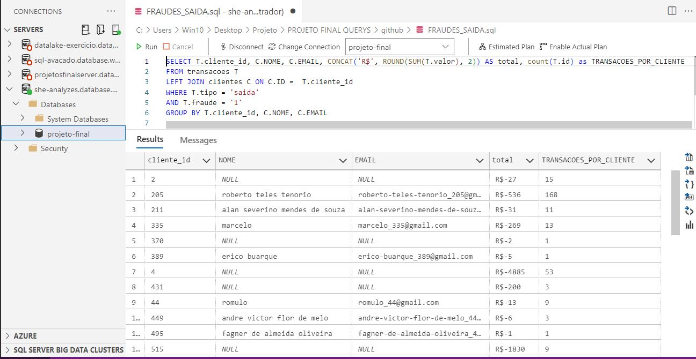
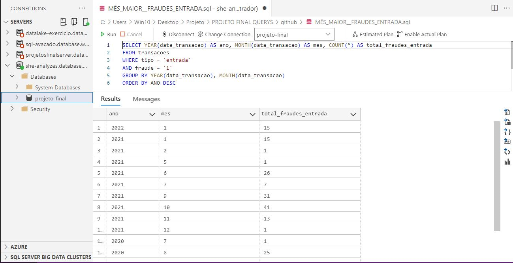
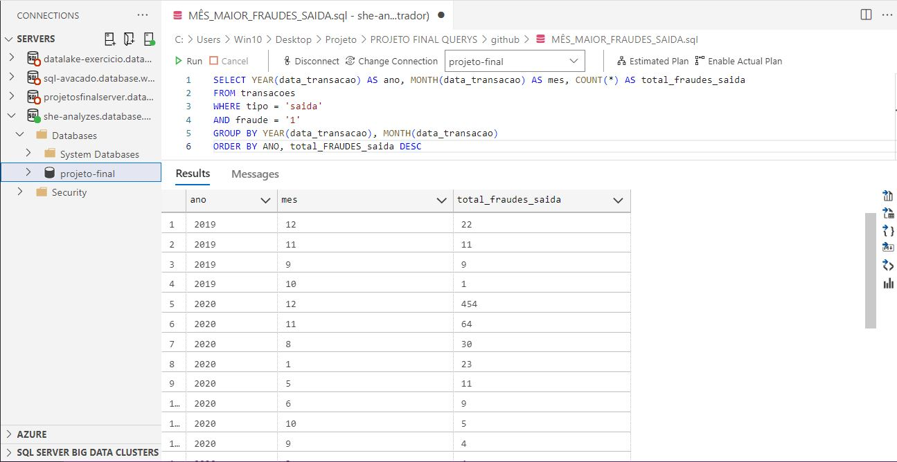
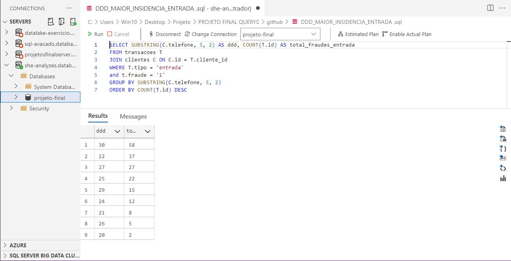
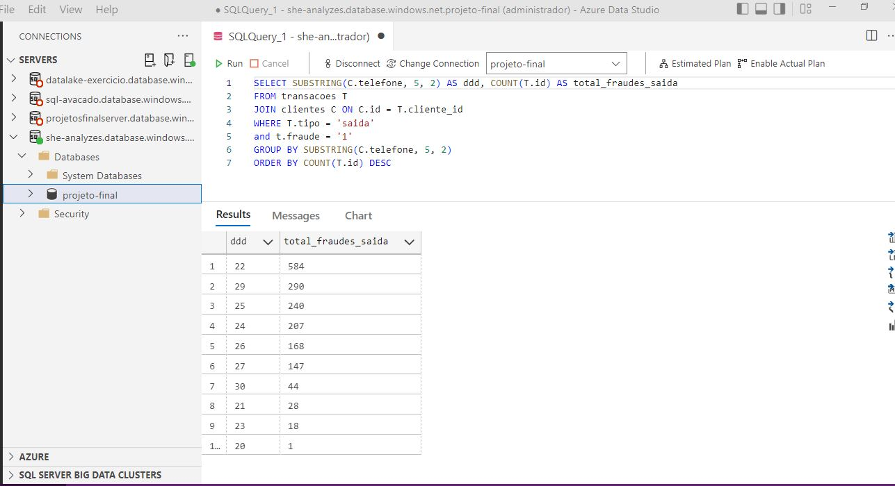
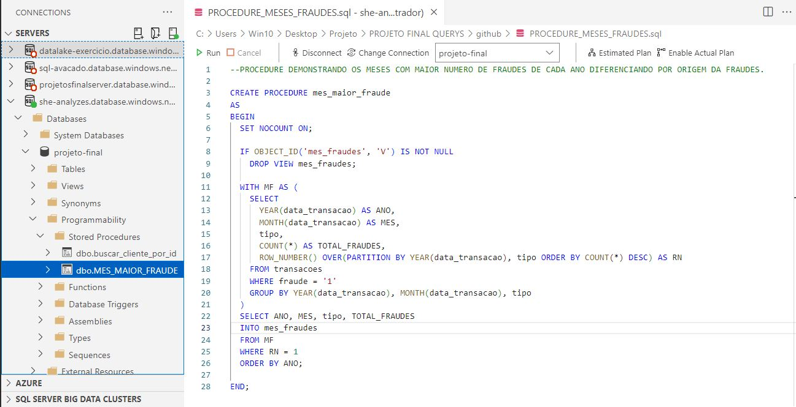
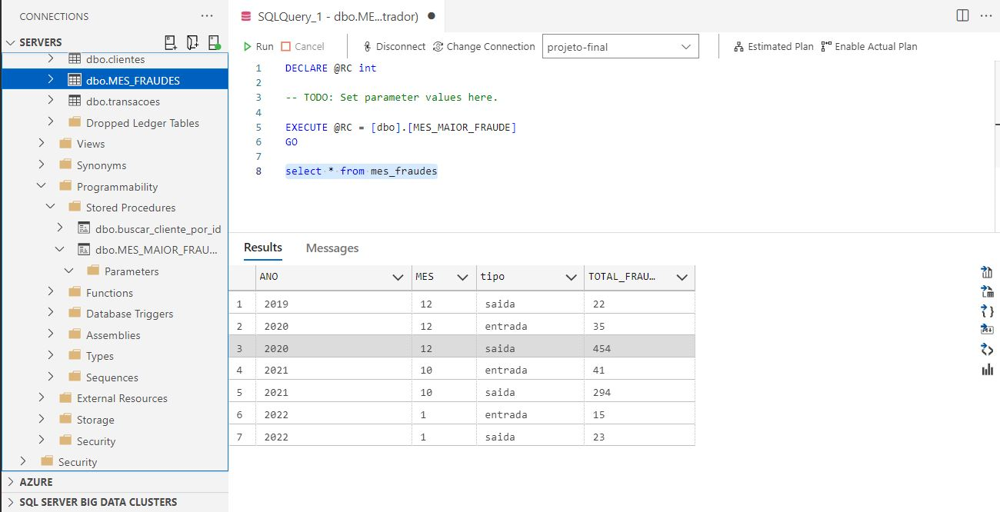
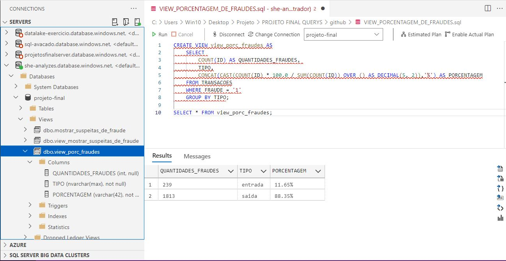

# Accenture Data Engineer/Azure - DESAFIO FINAL

## Tabela de conteúdos

**=================**

  - [Visão geral](#visão-geral)
  - [Desafio?](#qual-o-desafio)
  - [Objetivos](#objetivos)
  - [Analisando o problema](#analisando-o-problema)
  - [Tabela de conteúdos](#tabela-de-conteúdos)
  - [Features](#features)
  - [Relatórios do Power BI](#relatórios-do-power-bi)
  - [🛠 Tecnologias](#-tecnologias)
  - [Grupo](#grupo)
  
   **=================**
   
   ## Visão geral
   

 #### **Esse repositório apresentará o que foi desenvolvido no RELATÓRIO DE SQL**

Você poderá encontrar informações detalhadas sobre o desafio [aqui](https://docs.google.com/document/d/10fBZm7Sxm60FEIyNk4rqUE-pJLhXRxDi1grAATF7hVw/edit)!

**=================**

### **Desafio**

Desenvolver uma aplicação em Python para carga de arquivos em um banco de dados SQL e gerar relatórios estatísticos visando a descoberta de fraudes em conta corrente.
Link do desafio:          https://docs.google.com/document/d/10fBZm7Sxm60FEIyNk4rqUE-pJLhXRxDi1grAATF7hVw/edit

**=================**

### **Objetivos**

Seu objetivo inicial é analisar arquivos criando uma base de dados relacional para fazer a carga e depois analisá-la. O cartão fraudado, será aquele que tiver movimentações abaixo de 2 minutos de espaçamento entre as transações.
**=================**

### **Analisando o problema:**

<ul>
    <li>Brainstorm: https://whimsical.com/projeto-final-5zim4iYZrkWQ2Dbpy2knML</li>
    <li>Atribuição das atividades: https://trello.com/b/4JhJb0Iz/project-data-azure-desafio-final</li>
</ul>

**=================**

## **Features**

- [x]  Script de migração em Pandas (Para acessar o repositório do projeto em Pandas, acesse [aqui](https://github.com/SheAnalyzes/projeto-final-pandas/).
- [x]  Script de migração em Spark (Para acessar o repositório do projeto em Spark, acesse [aqui](https://github.com/SheAnalyzes/projeto-final-spark).
- [x]  Modelo de Entidades e Relacionamentos
- [x]  Relatórios de análise em SQL
- [x]  Relatórios de análise em PowerBI (Para acessar o repositório do relatório em PowerBI acesse [aqui](https://github.com/SheAnalyzes/projeto-final-powerbi).
- [x]  Códigos versionados no github.com

**=================**

## **Relatórios SQL**

<li>- [x]  Demonstração dos clientes fraudados na entrada, informando o total do valor fraudado e a quantidade de fraudes por clientes<li>
  
  
  
<li>- [x]  Demonstração dos clientes fraudados na saida, informando o total do valor fraudado e a quantidade de fraudes por clientes<li>
  
  
  
<li>- [x]  Agrupado por ano, demonstra qual mês houve maior insidencia de fraudes de entrada<li>
  
 
  
<li>- [x]  Agrupado por ano, demonstra qual mês houve maior insidencia de fraudes de saida<li>
  
 
  
<li>- [x]  Query dos clientes cadastrados, qual ddd que aparece com maior insidencia nas fraudes de transacoes de entrada<li>
  
 
  
<li>- [x]  Query dos clientes cadastrados, qual ddd que aparece com maior insidencia nas fraudes de transacoes de saida<li>
  
 
  
<li>- [x]  Procedure demonstrativa dos meses com maior fraude de cada ano diferenciando por origem da fraude<li>
  
 
  
<li>- [x]  Consultando a tabela criada pela procedure que mostra os meses com maior numero de fraudes de cada ano diferenciando por origem da fraudes<li>
  
 
  
<li>- [x]  VIEW criação de view para porcentagem de fraudes<li>
  
 
  
<li>- [x]  Consultando a view da porcentagem de fraudes<li>
  
 

  
  **=================**
## **🛠 Tecnologias**

As seguintes ferramentas foram usadas nessa ETAPA do projeto:

<ul>    <li>Git</li>
  <li>Linguagem SQL</li>
    <li>Trello</li>
    <li>Banco de Dados - Azure Data Studio</li>
</ul>
  
**=================**

   
## **Grupo** - SheAnalyses

| Ana Paula Santos de Queiroz  Linkedin: [/ana-paula-santos-de-queiroz-086807166](https://www.linkedin.com/in/ana-paula-santos-de-queiroz-086807166/) Github: [/Queirozaps](https://github.com/Queirozaps) |  |
| :---------------------------------------------------------------------------------------------------------------------------------------------------------------------------------------------------------------: | :--------------------------------------------: |
|  **Arianna Silveira Santos**    Linkedin: [/arianna-silveira-aa474514b](https://www.linkedin.com/in/arianna-silveira-aa474514b/) Github: [/AriannaSilveira](https://github.com/AriannaSilveira)  |  |
|                            **Carolina Gois**  Linkedin: [/carolina-gois](https://www.linkedin.com/in/carolina-gois/) Github: [/carolgois](https://github.com/carolgois)                            |  |
|                   **Emilly Correa Santiago**  Linkedin: [/emillysantiago23](https://www.linkedin.com/in/emillysantiago23/) Github: [/emillysant](https://github.com/emillysant)                   |  |
|                              **Mariana Freire**  Linkedin: [/maricf](https://www.linkedin.com/in/maricf/) Github: [/marianafreire](https://github.com/marianafreire)                              |  |
|             **Priscila Assumpção Fernandes**  Linkedin: [/priscila-af](https://www.linkedin.com/in/priscila-af/) Github: [/priscilaassumpcao](https://github.com/priscilaassumpcao)             |  |
|                    **Vivian Medina**  Linkedin: [/vivian-medina-b7250961](https://www.linkedin.com/in/vivian-medina-b7250961/) Github: [/medinavi](https://github.com/medinavi)                    |  |
 

